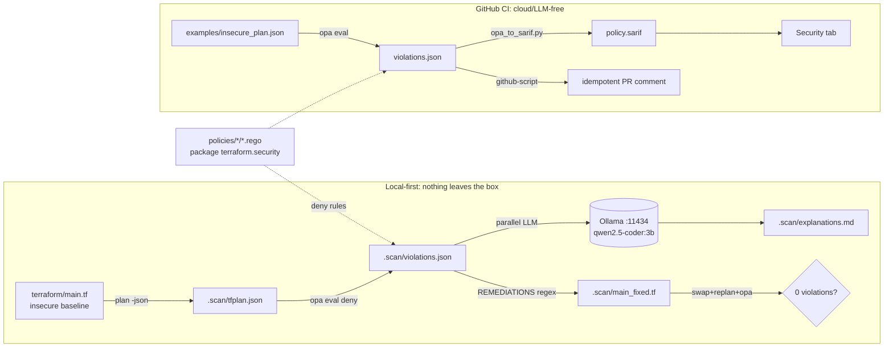

# Architecture — policy-as-code-ai

Local-first Policy-as-Code for Azure IaC with **provable, deterministic remediation**.

## Overview

Flow: `terraform plan` → JSON → **OPA/Rego** (10 packs, rule ids `AZ-*`) emit `deny` violations → a
**local LLM (Ollama)** explains each violation's risk in parallel, while a **deterministic map**
(`REMEDIATIONS`) writes the fix via regex on `main.tf` → `make verify` re-runs the gate and **proves 0
violations**. CI is a separate path: cloud/LLM-free, runs OPA on a static fixture and exports **SARIF to
the Security tab** + an idempotent PR comment. `terraform/main.tf` is an intentionally-insecure baseline.

## Data flow

## File map

| Path | Role | Why |
|---|---|---|
| `scripts/scan_iac.sh` | plan→JSON→`opa eval data.terraform.security.deny`, exit 2 on violations | exit-2 lets the Makefile distinguish "found violations" (expected) from a real error |
| `src/explainer.py` | AI explainer + deterministic remediation + diff; pluggable backends | God node. LLM only for the *explanation*; the *fix* is deterministic → no hallucinated infra |
| `src/explainer.py:REMEDIATIONS` | `rule id → {attr: HCL value}` | The "deterministic" key: regex `subn` replaces only the attribute RHS (`apply_remediations`) |
| `scripts/verify_fix.sh` | swap `main_fixed.tf`→`main.tf`, replan+OPA, restore via `trap` | The "provable" pillar; the trap guarantees the insecure baseline is always restored |
| `policies/<cat>/enforce_<cat>.rego` | 10 Azure packs, `package terraform.security` | Split by category (was monolith) → 45 OPA tests green |
| `scripts/opa_to_sarif.py` | OPA JSON → SARIF 2.1.0 | Separate from the explainer on purpose: CI stays LLM-free |
| `.github/workflows/policy-scan.yml` | tests job + policy-scan job (SARIF + PR comment) | Runs on a static fixture — no Azure creds/terraform in CI |
| `terraform/main.tf` | Insecure baseline | The demo material; deliberately bad |
| `examples/insecure_plan.json` | Static plan fixture for CI | Enables "self-proving CI" without cloud auth |

## Execution flow (`make demo` → `make verify`)

1. `Makefile:scan` → `scripts/scan_iac.sh` — `terraform plan -out` → `terraform show -json` → `opa eval ... 'data.terraform.security.deny'` → `.scan/violations.json`, exit 2.
2. `Makefile:explain` → `explainer.py:main` → `_async_main` — `load_violations` reads `result[0].expressions[0].value`.
3. `get_backend` → default `OllamaBackend`; `explain_all` runs all LLM calls via `asyncio.to_thread` in parallel.
4. `--remediate` → `apply_remediations` regex `subn` per `(rule, attr)` on `main.tf` → writes `.scan/main_fixed.tf` + unified diff.
5. `Makefile:verify` → `verify_fix.sh` — `cp main_fixed.tf main.tf` inside `trap restore EXIT`, replan + `opa eval`, `count==0` → "✓ Proof" exit 0, else exit 2.
6. CI (independent): `opa eval -i examples/insecure_plan.json` → `opa_to_sarif.py` → SARIF upload + PR comment.

## Design decisions

- **LLM only for explanation, not the fix** (`REMEDIATIONS` map + regex). The real differentiator — the AI cannot write wrong infra.
- **Fail-closed remediation** for NSG: `access="Deny"` rather than guessing CIDR/port.
- **CI deliberately LLM-free/cloud-free** — runs on a fixture. Trade-off: the rule→fix mapping is **triple-duplicated** (explainer `REMEDIATIONS`, `opa_to_sarif RULE_ATTR`, PR-comment inline JS) and hand-maintained.
- **Pluggable backends** (Ollama/AzureOpenAI/Anthropic) already implemented; `NEXT_SESSION.md` docs are stale on this.

## Open questions / risks

- **Drift risk #1 — triple copy of the rule→fix mapping** across 3 files/3 languages. Adding a rule = 4 places (rego, REMEDIATIONS, RULE_ATTR, PR-comment JS + DOCS×2). A single source of truth (e.g. `rules.yaml`) is the most urgent v2 refactor.
- **Anthropic backend model stale**: `claude-3-5-sonnet-latest`.
- **SARIF line mapping** hardcoded to `terraform/main.tf` (`opa_to_sarif.py:build_sarif`) — breaks if another file is scanned.
- **`apply_remediations` regex** matches the attribute anywhere in the file; with multiple resources sharing an attribute it may patch already-correct resources (not resource-scoped).

## Graph

- **God node**: `src/explainer.py` (degree 11).
- **Hub scripts**: `scan_iac.sh` (6), `terraform/main.tf` (5).
- **Surprising cross-type**: `ci → explainer` = AMBIGUOUS — CI does *not* call the explainer; it re-implements fixes inline in JS (root of the drift risk).
- **INFERRED coupling**: `DOCS`/`RULE_ATTR`/`REMEDIATIONS` — three parallel maps hand-synced across 2 files.

Full graph: `.cartographer/graph.json` (19 nodes, 28 edges, 32 files hashed).
