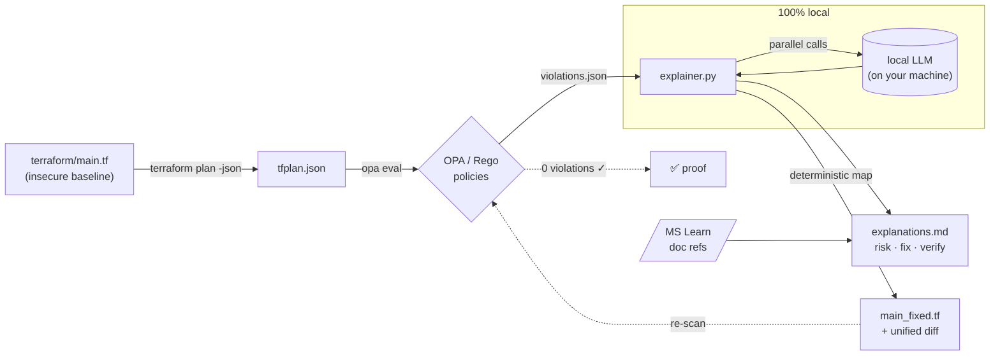

# 🛡️ Policy-as-Code + AI Drift Explainer

> **Local-first policy-as-code with provable remediation.**
> The AI explains why each Terraform misconfiguration is risky. A deterministic engine writes the fix. The pipeline then re-runs the policy gate to prove the fix holds. All of it runs on your machine, so your infrastructure code never leaves it.


[](https://github.com/KatsaounisThanasis/policy-as-code-ai/actions/workflows/policy-scan.yml)


**60-second tour:** `make scan` finds the misconfigurations, `make explain` has a local LLM tell you why each one is risky, `make remediate` writes the fix, and `make verify` re-runs the gate to prove it's clean. Nothing leaves your machine.

---

## The problem

Security scanners (Checkov, tfsec, OPA, KICS) are good at telling you what's wrong with your Infrastructure-as-Code, and not much help after that. A typical run dumps 200 findings into a backlog. A security engineer files a ticket. Weeks later an infra engineer maybe fixes it. Meanwhile the misconfiguration ships to production.

Two gaps stay open:

1. **Understanding.** A finding like `AZ-STORAGE-003: public_network_access_enabled` means nothing to a developer in a hurry. Why does it matter? What's the blast radius?
2. **Action.** Even when the fix is obvious, somebody still has to write it and prove it actually closes the finding.

## What this does

A closed loop that turns a raw policy violation into a verified fix:

```
terraform plan ─▶ OPA/Rego scan ─▶ AI explains each violation ─▶ deterministic fix ─▶ re-scan proves 0 violations
```

- OPA/Rego evaluates the Terraform plan and emits structured violations.
- A local LLM writes a short risk explanation and a verification hint for each one, with a link to the matching Microsoft Learn doc.
- A deterministic remediation engine patches the offending attributes and emits a unified diff.
- The patched file gets re-scanned, and the report shows it now passes with 0 violations. That's the proof.

## Why it's different

Plenty of tools now do "AI scans IaC and opens a PR." This one makes three deliberate choices that most of them get wrong.

### 🔒 Local-first / private / zero-cost

Everything runs on your machine via a local LLM. Your Terraform usually encodes network topology, resource names, and security posture, and none of it gets sent to a third-party LLM API. No per-review token bill, no data-egress risk. Most competitors send your IaC to a cloud API and tell you to strip secrets first.

### ✅ Provable remediation

The fix isn't just generated, it's verified. The patched Terraform is re-evaluated against the same policy set, and the report shows `0 violations`. A clean re-scan is hard evidence the fix is correct, not a hopeful "looks good to me."

### 🎯 Deterministic fixes, AI for understanding

The LLM explains; it doesn't write the fix. Remediation comes from a deterministic rule→attribute map, so it's reproducible and free of hallucinations. That covers the unambiguous cases ("set TLS to 1.2", "disable public access"). Context-dependent ones, like "which CIDR is allowed?", are left for a human to approve.

## Architecture



## Quick start

**Prerequisites:** `terraform`, `opa`, `jq`, `az` (logged in), a local LLM runtime (Ollama by default), `python3`.

```bash
# 0. verify your toolchain
make tools-check

# 1. scan: terraform plan -> OPA -> violations  (exit 2 = violations found, expected)
make scan

# 2. explain: local LLM writes risk + fix + verification for each violation
make explain

# 3. remediate: write a fixed Terraform file + unified diff
make remediate

# 4. verify: re-scan the fixed Terraform and PROVE it passes the gate (0 violations)
make verify

# or run the whole story end-to-end
make demo
```

## Tests

```bash
make test          # runs the OPA policy tests + the Python unit tests
```

- **OPA** (`policies/**/*_test.rego`): every rule is checked to fire on a violating
  resource and stay silent on a compliant one, plus whole-policy checks (fully-compliant
  → 0 denials, fully-insecure → all rules fire).
- **pytest** (`tests/test_explainer.py`): unit tests for the parser, prompt builder,
  deterministic remediator, and the async LLM fan-out. The LLM is mocked, so the suite is
  fast, deterministic, and needs no network or local model.

## LLM backends (pluggable)

The explainer is local-first by default (Ollama, `qwen2.5-coder:3b`), so nothing leaves
your machine. To use a hosted model instead, set one env var. The rest of the pipeline
(scan, remediation, SARIF, verify) doesn't change.

```bash
# default — local, private
ollama pull qwen2.5-coder:3b
make explain

# Azure OpenAI
export LLM_BACKEND=azureopenai
export AZURE_OPENAI_ENDPOINT="https://<resource>.openai.azure.com"
export AZURE_OPENAI_API_KEY="..."
export AZURE_OPENAI_DEPLOYMENT="<deployment-name>"
make explain

# Anthropic
export LLM_BACKEND=anthropic
export ANTHROPIC_API_KEY="..."
make explain
```

Backends sit behind a small `LLMBackend` abstraction in `src/explainer.py`
(`get_backend()` resolves `--backend`/`$LLM_BACKEND`), so adding another provider is one
class. The unit tests mock that interface, so the suite never touches a real model.

## What it catches today

The policy set is organised by resource category under `policies/<category>/`:

**Storage Account** (`policies/storage/`)

| Rule | Severity | Checks |
|------|----------|--------|
| `AZ-STORAGE-001` | high   | Nested blobs must not be public |
| `AZ-STORAGE-002` | medium | Shared access key auth disabled |
| `AZ-STORAGE-003` | high   | Public network access disabled |
| `AZ-STORAGE-004` | medium | Minimum TLS version is `TLS1_2` |
| `AZ-STORAGE-005` | high   | HTTPS-only traffic enforced |

**Network Security Group** (`policies/network/`)

| Rule | Severity | Checks |
|------|----------|--------|
| `AZ-NSG-001` | high   | No inbound `Allow` from a public source (`*`/`0.0.0.0/0`/`Internet`) to a sensitive/any port |
| `AZ-NSG-002` | medium | No inbound rule opening **all** ports (`destination_port_range = "*"`) |

**Key Vault** (`policies/keyvault/`)

| Rule | Severity | Checks |
|------|----------|--------|
| `AZ-KV-001` | high | Purge protection enabled |
| `AZ-KV-002` | high | Public network access disabled |

**SQL Server** (`policies/sql/`)

| Rule | Severity | Checks |
|------|----------|--------|
| `AZ-SQL-001` | high   | Public network access disabled |
| `AZ-SQL-002` | medium | Minimum TLS version is `1.2` |

**App Service** (`policies/appservice/`)

| Rule | Severity | Checks |
|------|----------|--------|
| `AZ-APP-001` | high   | `https_only` enforced |
| `AZ-APP-002` | medium | `site_config` minimum TLS version is `1.2` |

**Managed Disk** (`policies/disk/`)

| Rule | Severity | Checks |
|------|----------|--------|
| `AZ-DISK-001` | high   | Public network access disabled |
| `AZ-DISK-002` | medium | Network access policy is not `AllowAll` |

**Cosmos DB** (`policies/cosmos/`)

| Rule | Severity | Checks |
|------|----------|--------|
| `AZ-COSMOS-001` | high | Public network access disabled |

**AKS** (`policies/aks/`)

| Rule | Severity | Checks |
|------|----------|--------|
| `AZ-AKS-001` | high   | Local accounts disabled |
| `AZ-AKS-002` | medium | Azure Policy add-on enabled |

**Container Registry** (`policies/acr/`)

| Rule | Severity | Checks |
|------|----------|--------|
| `AZ-ACR-001` | high   | Admin user disabled |
| `AZ-ACR-002` | medium | Public network access disabled |

**Log Analytics** (`policies/loganalytics/`)

| Rule | Severity | Checks |
|------|----------|--------|
| `AZ-LOG-001` | medium | No query access over the public internet |

> **Deterministic vs. human judgement:** most findings have one unambiguous fix that gets
> auto-applied. The NSG "allow-any" rule has no single correct CIDR or port, so its fix is
> fail-closed (`access = "Deny"`): it shuts the hole and leaves the precise scoping to a
> human. That's the boundary the tool is honest about.

> **No cost, no risk:** the pipeline only runs `terraform plan`, never `apply`. OPA reads
> the plan JSON, so no Azure resources are ever created.

## Continuous Integration

`.github/workflows/policy-scan.yml` runs on every pull request and push to `main`:

- The **`tests` job** runs the OPA policy tests and the Python unit tests.
- The **`policy-scan` job** evaluates the policy set against a committed Terraform plan
  fixture (`examples/insecure_plan.json`), then:
  - converts the violations to SARIF (`scripts/opa_to_sarif.py`) and uploads them, so
    findings show up in the repo's **Security ▸ Code scanning** tab with file locations and
    severities;
  - posts a PR comment (updated in place, not duplicated) listing each violation and its
    deterministic fix.

The CI is cloud-free and LLM-free on purpose. It scans a plan fixture instead of calling
Azure, and the AI explanations stay a local `make explain` step, so the "your IaC never
leaves your machine" guarantee holds even in CI.

## Project layout

```
.
├── terraform/main.tf            # intentionally-insecure Azure baseline (10 resource types)
├── policies/                    # OPA policy set (Rego v1), one folder per category
│   ├── storage/  network/  keyvault/  sql/  appservice/
│   └── disk/  cosmos/  aks/  acr/  loganalytics/      # each: rules + tests
├── scripts/scan_iac.sh          # plan -> json -> opa eval pipeline
├── scripts/opa_to_sarif.py      # OPA violations -> SARIF (for the Security tab)
├── src/explainer.py             # local-LLM explainer + deterministic remediator
├── examples/insecure_plan.json  # sanitized plan fixture used by CI
├── Makefile                     # scan / explain / remediate / verify / demo / test
└── .scan/                       # generated reports (sample output kept in repo)
```

## License

[MIT](./LICENSE)
