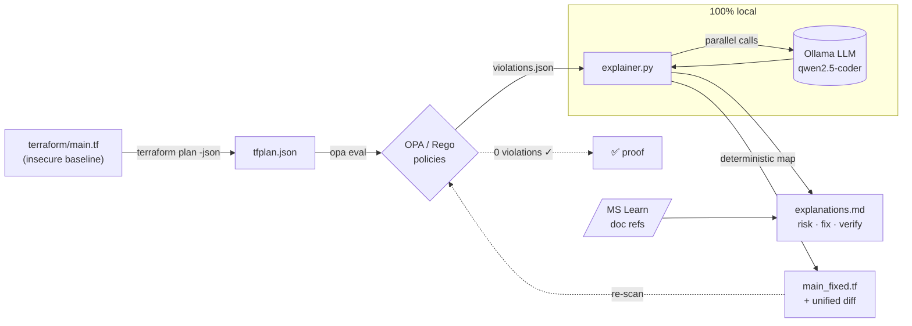

# 🛡️ Policy-as-Code + AI Drift Explainer

> **Local-first policy-as-code with _provable_ remediation.**
> The AI explains **why** each Terraform misconfiguration is a risk, a deterministic engine **fixes** it, and the pipeline **proves** the fix passes the policy gate again — all running locally, so your infrastructure code never leaves your machine.


-000000)

[](https://github.com/KatsaounisThanasis/policy-as-code-ai/actions/workflows/policy-scan.yml)


---

## The problem

Security scanners (Checkov, tfsec, OPA, KICS) are great at telling you **what** is wrong with your Infrastructure-as-Code — and terrible at everything after that. A typical run dumps 200 findings into a backlog. A security engineer files a ticket. Weeks later, an infra engineer maybe fixes it. Meanwhile the misconfiguration ships to production.

Two gaps stay open:

1. **Understanding** — a finding like `AZ-STORAGE-003: public_network_access_enabled` means nothing to a developer in a hurry. *Why* does it matter? *What* is the blast radius?
2. **Action** — even when the fix is obvious, somebody has to write it, and prove it actually closes the finding.

## What this does

A closed loop that turns a raw policy violation into a **verified** fix:

```
terraform plan ─▶ OPA/Rego scan ─▶ AI explains each violation ─▶ deterministic fix ─▶ re-scan proves 0 violations
```

- **OPA/Rego** evaluates the Terraform plan and emits structured violations.
- A **local LLM (Ollama)** writes a human-readable *risk explanation + verification hint* for each one, citing the canonical Microsoft Learn doc.
- A **deterministic remediation engine** patches the offending attributes and emits a unified diff.
- The patched file is **re-scanned** — and the report shows it now passes with **0 violations**. That's the proof.

## Why it's different

Plenty of tools now do "AI scans IaC and opens a PR." This one is built around three deliberate choices that most of them get wrong:

### 🔒 Local-first / private / zero-cost
Everything runs on your machine via [Ollama](https://ollama.com). Your Terraform — which often encodes network topology, resource names, and security posture — **never gets sent to a third-party LLM API**. No per-review token bill, no data-egress risk. Most competitors send your IaC to a cloud API and warn you to strip secrets first.

### ✅ Provable remediation
The fix isn't just generated — it's **verified**. The patched Terraform is re-evaluated against the exact same policy set, and the report demonstrates `0 violations`. A clean re-scan is hard evidence the fix is correct, not a hopeful "looks good to me."

### 🎯 Deterministic fixes, AI for understanding
The LLM **explains**; it does **not** write the fix. Remediation comes from a deterministic rule→attribute map, so it is reproducible and free of hallucinations. (Trade-off, stated honestly: this covers *unambiguous* fixes — "set TLS to 1.2", "disable public access". Context-dependent fixes like "which CIDR is allowed?" are left for human approval.)

## Architecture



## Quick start

**Prerequisites:** `terraform`, `opa`, `jq`, `az` (logged in), `ollama` (with a code model pulled), `python3`.

```bash
# 0. verify your toolchain
make tools-check

# 1. scan: terraform plan -> OPA -> violations  (exit 2 = violations found, expected)
make scan

# 2. explain: local LLM writes risk + fix + verification for each violation
make explain

# 3. remediate: write a fixed Terraform file + unified diff
make remediate

# 4. verify: re-scan the fixed Terraform and PROVE it passes the gate (0 violations)
make verify

# or run the whole story end-to-end
make demo
```

## Tests

```bash
make test          # runs the OPA policy tests + the Python unit tests
```

- **OPA** (`policies/**/*_test.rego`): every rule is asserted to fire on a
  violating resource and stay silent on a compliant one, plus whole-policy checks
  (fully-compliant → 0 denials, fully-insecure → all rules fire).
- **pytest** (`tests/test_explainer.py`): unit tests for the parser, prompt builder,
  deterministic remediator, and the async LLM fan-out — with the LLM **mocked**, so the
  suite is fast, deterministic, and needs no network or Ollama.

## LLM backends (pluggable)

The explainer is **local-first by default** (Ollama, `qwen2.5-coder:3b`) — nothing
leaves your machine. If you'd rather use a hosted model, switch backend with one env
var; the rest of the pipeline (scan, remediation, SARIF, verify) is unchanged.

```bash
# default — local, private
ollama pull qwen2.5-coder:3b
make explain

# Azure OpenAI
export LLM_BACKEND=azureopenai
export AZURE_OPENAI_ENDPOINT="https://<resource>.openai.azure.com"
export AZURE_OPENAI_API_KEY="..."
export AZURE_OPENAI_DEPLOYMENT="<deployment-name>"
make explain

# Anthropic
export LLM_BACKEND=anthropic
export ANTHROPIC_API_KEY="..."
make explain
```

Backends live behind a small `LLMBackend` abstraction in `src/explainer.py`
(`get_backend()` resolves `--backend`/`$LLM_BACKEND`), so adding another provider is
one class. The unit tests mock this interface, so the suite never touches a real model.

## What it catches today

The policy set is organised by resource category under `policies/<category>/`:

**Storage Account** (`policies/storage/`)

| Rule | Severity | Checks |
|------|----------|--------|
| `AZ-STORAGE-001` | high   | Nested blobs must not be public |
| `AZ-STORAGE-002` | medium | Shared access key auth disabled |
| `AZ-STORAGE-003` | high   | Public network access disabled |
| `AZ-STORAGE-004` | medium | Minimum TLS version is `TLS1_2` |
| `AZ-STORAGE-005` | high   | HTTPS-only traffic enforced |

**Network Security Group** (`policies/network/`)

| Rule | Severity | Checks |
|------|----------|--------|
| `AZ-NSG-001` | high   | No inbound `Allow` from a public source (`*`/`0.0.0.0/0`/`Internet`) to a sensitive/any port |
| `AZ-NSG-002` | medium | No inbound rule opening **all** ports (`destination_port_range = "*"`) |

**Key Vault** (`policies/keyvault/`)

| Rule | Severity | Checks |
|------|----------|--------|
| `AZ-KV-001` | high | Purge protection enabled |
| `AZ-KV-002` | high | Public network access disabled |

**SQL Server** (`policies/sql/`)

| Rule | Severity | Checks |
|------|----------|--------|
| `AZ-SQL-001` | high   | Public network access disabled |
| `AZ-SQL-002` | medium | Minimum TLS version is `1.2` |

**App Service** (`policies/appservice/`)

| Rule | Severity | Checks |
|------|----------|--------|
| `AZ-APP-001` | high   | `https_only` enforced |
| `AZ-APP-002` | medium | `site_config` minimum TLS version is `1.2` |

**Managed Disk** (`policies/disk/`)

| Rule | Severity | Checks |
|------|----------|--------|
| `AZ-DISK-001` | high   | Public network access disabled |
| `AZ-DISK-002` | medium | Network access policy is not `AllowAll` |

**Cosmos DB** (`policies/cosmos/`)

| Rule | Severity | Checks |
|------|----------|--------|
| `AZ-COSMOS-001` | high | Public network access disabled |

**AKS** (`policies/aks/`)

| Rule | Severity | Checks |
|------|----------|--------|
| `AZ-AKS-001` | high   | Local accounts disabled |
| `AZ-AKS-002` | medium | Azure Policy add-on enabled |

**Container Registry** (`policies/acr/`)

| Rule | Severity | Checks |
|------|----------|--------|
| `AZ-ACR-001` | high   | Admin user disabled |
| `AZ-ACR-002` | medium | Public network access disabled |

**Log Analytics** (`policies/loganalytics/`)

| Rule | Severity | Checks |
|------|----------|--------|
| `AZ-LOG-001` | medium | No query access over the public internet |

> **Deterministic vs. human-judgement:** Storage and Key Vault findings have unambiguous
> fixes that are auto-applied. The NSG "allow-any" rule has no single correct CIDR/port, so
> the deterministic fix is **fail-closed** (`access = "Deny"`) — it closes the hole and leaves
> the precise scoping to a human, exactly the boundary this tool is honest about.

> **No cost, no risk:** the pipeline runs `terraform plan` only — it **never applies**. OPA evaluates the plan JSON, so no Azure resources are ever created.

## Continuous Integration

`.github/workflows/policy-scan.yml` runs on every pull request and push to `main`:

- **`tests` job** — runs the OPA policy tests and the Python unit tests.
- **`policy-scan` job** — evaluates the policy set against a committed Terraform
  plan fixture (`examples/insecure_plan.json`), then:
  - converts the violations to **SARIF** (`scripts/opa_to_sarif.py`) and uploads them,
    so findings appear in the repository's **Security ▸ Code scanning** tab with file
    locations and severities;
  - posts (and idempotently updates) a **PR comment** listing each violation and the
    deterministic fix.

The CI is intentionally **cloud-free and LLM-free**: it scans a plan fixture rather
than calling Azure, and the AI risk explanations stay a local `make explain` step —
keeping the "your IaC never leaves your machine" guarantee true even in CI.

## Project layout

```
.
├── terraform/main.tf            # intentionally-insecure Azure baseline (storage + NSG + Key Vault)
├── policies/                    # OPA policy set (Rego v1), by category
│   ├── storage/                 #   AZ-STORAGE-00x (+ tests)
│   ├── network/                 #   AZ-NSG-00x (+ tests)
│   └── keyvault/                #   AZ-KV-00x (+ tests)
├── scripts/scan_iac.sh          # plan -> json -> opa eval pipeline
├── scripts/opa_to_sarif.py      # OPA violations -> SARIF (for the Security tab)
├── src/explainer.py             # local-LLM explainer + deterministic remediator
├── examples/insecure_plan.json  # sanitized plan fixture used by CI
├── Makefile                     # scan / explain / remediate / verify / demo / test
└── .scan/                       # generated reports (sample output kept in repo)
```

## Roadmap

- [x] Closed loop: scan → explain → remediate → **re-scan proves 0 violations**
- [x] Parallel LLM calls (asyncio) + auto-remediation with unified diff
- [x] OPA test suite (`policies/*_test.rego`) + pytest for the explainer (mocked LLM)
- [x] GitHub Actions: policy scan on PRs → **SARIF export to the Security tab** + a PR comment with violations and deterministic fixes (cloud- and LLM-free)
- [x] Broader policies (NSG open ports, Key Vault) organised by category
- [x] Pluggable LLM backend (Ollama · Azure OpenAI · Anthropic, via env var)

## License

[MIT](./LICENSE)
