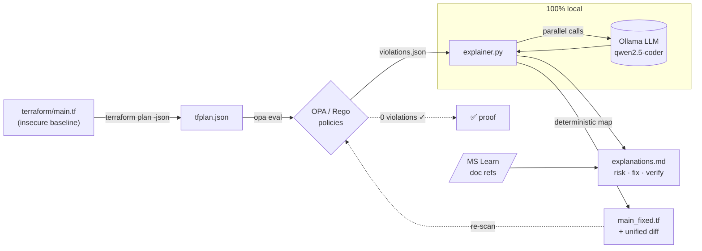

# 🛡️ Policy-as-Code + AI Drift Explainer

> **Local-first policy-as-code with _provable_ remediation.**
> The AI explains **why** each Terraform misconfiguration is a risk, a deterministic engine **fixes** it, and the pipeline **proves** the fix passes the policy gate again — all running locally, so your infrastructure code never leaves your machine.


-000000)


---

## The problem

Security scanners (Checkov, tfsec, OPA, KICS) are great at telling you **what** is wrong with your Infrastructure-as-Code — and terrible at everything after that. A typical run dumps 200 findings into a backlog. A security engineer files a ticket. Weeks later, an infra engineer maybe fixes it. Meanwhile the misconfiguration ships to production.

Two gaps stay open:

1. **Understanding** — a finding like `AZ-STORAGE-003: public_network_access_enabled` means nothing to a developer in a hurry. *Why* does it matter? *What* is the blast radius?
2. **Action** — even when the fix is obvious, somebody has to write it, and prove it actually closes the finding.

## What this does

A closed loop that turns a raw policy violation into a **verified** fix:

```
terraform plan ─▶ OPA/Rego scan ─▶ AI explains each violation ─▶ deterministic fix ─▶ re-scan proves 0 violations
```

- **OPA/Rego** evaluates the Terraform plan and emits structured violations.
- A **local LLM (Ollama)** writes a human-readable *risk explanation + verification hint* for each one, citing the canonical Microsoft Learn doc.
- A **deterministic remediation engine** patches the offending attributes and emits a unified diff.
- The patched file is **re-scanned** — and the report shows it now passes with **0 violations**. That's the proof.

## Why it's different

Plenty of tools now do "AI scans IaC and opens a PR." This one is built around three deliberate choices that most of them get wrong:

### 🔒 Local-first / private / zero-cost
Everything runs on your machine via [Ollama](https://ollama.com). Your Terraform — which often encodes network topology, resource names, and security posture — **never gets sent to a third-party LLM API**. No per-review token bill, no data-egress risk. Most competitors send your IaC to a cloud API and warn you to strip secrets first.

### ✅ Provable remediation
The fix isn't just generated — it's **verified**. The patched Terraform is re-evaluated against the exact same policy set, and the report demonstrates `0 violations`. A clean re-scan is hard evidence the fix is correct, not a hopeful "looks good to me."

### 🎯 Deterministic fixes, AI for understanding
The LLM **explains**; it does **not** write the fix. Remediation comes from a deterministic rule→attribute map, so it is reproducible and free of hallucinations. (Trade-off, stated honestly: this covers *unambiguous* fixes — "set TLS to 1.2", "disable public access". Context-dependent fixes like "which CIDR is allowed?" are left for human approval.)

## Architecture



## Quick start

**Prerequisites:** `terraform`, `opa`, `jq`, `az` (logged in), `ollama` (with a code model pulled), `python3`.

```bash
# 0. verify your toolchain
make tools-check

# 1. scan: terraform plan -> OPA -> violations  (exit 2 = violations found, expected)
make scan

# 2. explain: local LLM writes risk + fix + verification for each violation
make explain

# 3. remediate: write a fixed Terraform file + unified diff
make remediate

# 4. verify: re-scan the fixed Terraform and PROVE it passes the gate (0 violations)
make verify

# or run the whole story end-to-end
make demo
```

The LLM backend defaults to `qwen2.5-coder:3b`:

```bash
ollama pull qwen2.5-coder:3b
```

## What it catches today

The bundled policy set targets Azure Storage Account misconfigurations:

| Rule | Severity | Checks |
|------|----------|--------|
| `AZ-STORAGE-001` | high   | Nested blobs must not be public |
| `AZ-STORAGE-002` | medium | Shared access key auth disabled |
| `AZ-STORAGE-003` | high   | Public network access disabled |
| `AZ-STORAGE-004` | medium | Minimum TLS version is `TLS1_2` |
| `AZ-STORAGE-005` | high   | HTTPS-only traffic enforced |

> **No cost, no risk:** the pipeline runs `terraform plan` only — it **never applies**. OPA evaluates the plan JSON, so no Azure resources are ever created.

## Project layout

```
.
├── terraform/main.tf            # intentionally-insecure Azure baseline
├── policies/enforce_security.rego  # OPA policy set (Rego v1)
├── scripts/scan_iac.sh          # plan -> json -> opa eval pipeline
├── src/explainer.py             # local-LLM explainer + deterministic remediator
├── Makefile                     # scan / explain / remediate / demo / test
└── .scan/                       # generated reports (sample output kept in repo)
```

## Roadmap

- [x] Closed loop: scan → explain → remediate → **re-scan proves 0 violations**
- [x] Parallel LLM calls (asyncio) + auto-remediation with unified diff
- [ ] OPA test suite (`policies/*_test.rego`) + pytest for the explainer (mocked LLM)
- [ ] GitHub Actions: scan + AI comment on PRs, **SARIF export to the Security tab**
- [ ] Broader policies (NSG open ports, Key Vault) organised by category
- [ ] Pluggable LLM backend (Ollama · Azure OpenAI · Anthropic, via env var)

## License

[MIT](./LICENSE)
